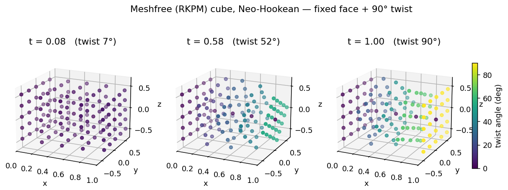
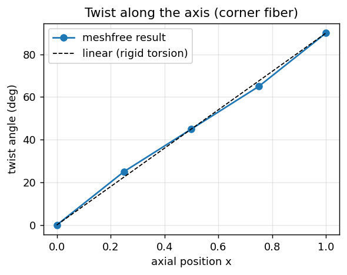

# Meshfree cube — fixed face + 90° twist (Neo-Hookean)

A large-deformation demonstration of Tahoe's **meshfree (RKPM)** large-strain element:
a unit cube of compressible **Neo-Hookean** material with one face fixed and the opposite
face rotated **90°** about the longitudinal axis.



## Model

- **Element**: `large_strain_meshfree` (`MeshFreeFSSolidT`) — RKPM shape functions with a
  cubic-spline window, hex background cells for integration.
- **Material**: `Simo_isotropic` — Simo's compressible isotropic hyperelastic
  (Neo-Hookean), `E = 100`, `ν = 0.3`.
- **Geometry**: `x ∈ [0, L]`, `y, z ∈ [−L/2, L/2]` (centered so the rotation axis is the
  x-axis), `L = 1`, a 4×4×4 hex mesh (125 nodes).
- **Boundary conditions**
  - `x = 0` face (node set 1): fully fixed.
  - `x = L` face (node set 2): affine `mapped_nodes` BC
    `u = schedule(t) · (R_x(90°) − I) · X`, with `R_x(90°) − I = [[0,0,0],[0,−1,−1],[0,1,−1]]`,
    ramped `0 → 1` over the run. At the end the far face is exactly `(y,z) → (−z, y)`.
  - Both BC faces are listed as **interpolant** nodes so the meshfree approximation
    enforces the prescribed displacements exactly (RKPM shape functions are not
    Kronecker-δ otherwise).
- **Loading**: quasi-static, 120 steps (0.75° per step), implicit Newton, `max_step_cuts=6`.

## Run

```bash
python3 generate_cube.py 4          # writes cube.geom/.node/.elem  (arg = elems/edge)
../../build/bin/tahoe -f cube_rotate.xml
python3 visualize.py                # writes cube_twist*.png  (needs netCDF4, matplotlib)
```

## Result

All 121 steps converge quadratically with no step cuts. Verified from the ExodusII output:

- far-face BC enforced exactly: `max |u − (R−I)X| = 4e-6`
- fixed face exactly zero
- far-face corners rotate exactly 90°:  `(±0.5, ±0.5) → (∓0.5, ±0.5)`
- **linear twist along the axis** (0° → 25° → 45° → 65° → 90° at x = 0, ¼, ½, ¾, 1) with the
  corner-fiber radius preserved at 0.707 — i.e. a near-rigid torsion, as expected.



The slight S-shape of the twist profile (vs. the dashed rigid-torsion line) is the expected
finite-deformation end effect for a short specimen.

## Notes

- Uses Tahoe's **existing** meshfree machinery (validated against the level.0 RKPM benchmarks),
  not the in-progress KL-shell element.
- The `mapped_nodes` BC morphs linearly in the affine map during the ramp (the intermediate
  far face is chord-interpolated, not rigid); only the **endpoint** is the exact rotation.
  For a strictly rigid rotation path, prescribe per-node arc schedules instead.
- Generated output (`*.exo`, `*.out`) is run-time only and can be regenerated.
