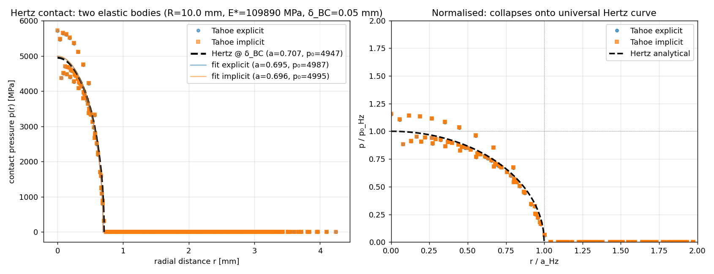
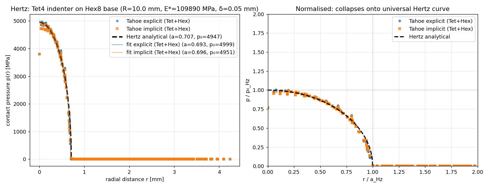

# Hertz contact benchmark — explicit + implicit Tahoe

Quarter-symmetry curved-bottom indenter on an elastic base, sized so
both bodies sit cleanly in the half-space limit Hertz assumes.  Same
mesh and material drive both Tahoe contact pathways:

- **explicit** — `<explicit_solid>` + central-difference + lumped mass
  + `<contact_3D_penalty>` with normal viscous damping (#31), driven
  toward the quasistatic limit by a smooth half-cosine ramp.
- **implicit** — classic `<updated_lagrangian>` + Newton-Raphson +
  `<contact_3D_penalty>`, ~3 quadratic-convergence iterations per
  load step.

The fitted Hertz parameters from both runs match the analytical
prediction within 1-2 % on contact radius `a`, total load `F`, and
peak pressure `p₀`.  Explicit and implicit agree with each other to
better than 0.5 % on every metric.

## Geometry

[generate_hertz_mesh.py](generate_hertz_mesh.py) writes an inline
Tahoe `.geom` with two element blocks (block 1 = sphere/indenter,
block 2 = base) and 8 node sets / 2 side sets:

```
R       = 10.0 mm    sphere radius (defines the curved bottom)
R_box   = 3.0  mm    quarter-square cross-section edge
h_top   = 6.0  mm    indenter top-plane height (≈ 8.5 × a_Hz)
H_base  = 6.0  mm    base block thickness     (≈ 8.5 × a_Hz)
gap     = 1e-3 mm    initial gap (avoids zero-penetration edge case)

nx = ny = 24,  nz_sph = 16     →  9 216 hex (sphere)
mx = my = 24,  mz_base = 12    →  6 912 hex (base)
total: 16 128 Hex8, 18 750 nodes
```

`h_top` and `H_base` are sized at ~8.5 × a_Hz so each block behaves as
a half-space — the Hertz limit.  `R_box = 3 mm` ≈ 4.2 × a_Hz keeps the
contact zone well inside the meshed quarter-square.

tanh grading concentrates resolution near the apex: smallest in-plane
element ≈ 0.041 mm, smallest dz ≈ 0.16 mm at apex.  ~11 elements
across the analytical contact radius a ≈ 0.71 mm.

> **Note on geometry**: this is *not* a true 1/8 sphere — it is a
> block with square cross-section and an arced bottom face.  A true
> 1/8 sphere requires a butterfly mesh with a Cartesian core at the
> apex (significant additional code).  The local geometry at the
> contact apex *is* spherical of radius R, which is the only
> ingredient Hertz mechanics needs.  R_box is chosen so the contact
> radius a ≪ R_box, keeping the simulation in the half-space limit.

Node sets:
| ID | description                                     |
|----|--------------------------------------------------|
| 1  | sphere top (driven by prescribed δ)             |
| 2  | sphere x = 0 (symmetry, u_x = 0)                |
| 3  | sphere y = 0 (symmetry, u_y = 0)                |
| 4  | base bottom (clamped)                           |
| 5  | base x = 0  (symmetry)                          |
| 6  | base y = 0  (symmetry)                          |
| 7  | sphere bottom (contact strikers)                |
| 8  | base top    (contact face nodes — *free*)       |

Side sets:
| ID | block | face | description                |
|----|-------|------|----------------------------|
| 1  | 1     | 1    | sphere bottom (-z)         |
| 2  | 2     | 2    | base top (+z)              |

## How to run

```bash
cd benchmark_XML/level.5/hertz
python3 generate_hertz_mesh.py             # writes geometry/hertz.geom
../../../build/bin/tahoe -f hertz_implicit.xml    # ~17 min serial
../../../build/bin/tahoe -f hertz_explicit.xml    # ~30-40 min, OpenMP
python3 compare_to_analytical.py            # writes hertz_pressure.png
```

## Material parameters

Both XMLs use `Simo_isotropic` on **both** blocks with the same
material:

```
E   = 200 000   (consistent units; with ρ = 7.85 the apparent c_p ≈ 159)
ν   = 0.3
ρ   = 7.85
```

This places the simulation in the **two identical elastic bodies**
Hertz regime:

  1/E* = 2(1−ν²)/E   →   E* = E/(2(1−ν²)) ≈ 109 890 MPa

(Earlier iterations used a kinematically rigid base — pinning all
three DOFs on NS8 — which doubled E* to E/(1−ν²) ≈ 220 GPa.  Removing
those pins gives the cleaner two-elastic-body scenario.)

## Boundary conditions

```
sphere top  (NS1): u_z = δ_BC × schedule(t),  δ_BC = −0.05 mm
sphere x=0  (NS2): u_x = 0          symmetry
sphere y=0  (NS3): u_y = 0          symmetry
base bottom (NS4): all DOFs = 0     clamped
base x=0    (NS5): u_x = 0          symmetry
base y=0    (NS6): u_y = 0          symmetry
base top    (NS8): free → base deforms elastically under the contact load
```

## Driving schedule

- **explicit**: half-cosine ramp 0 → 1 over t ∈ [0, 1] (11 control
  points); T = 1.0 contains ~16 wave traversals R/c_p ≈ 0.063 →
  quasistatic limit.  Δt = 1×10⁻⁴ (~0.7× CFL for h_min ≈ 0.041,
  c_p ≈ 159).  10 000 steps.  `viscous_damping = 2.0` on the contact
  pair suppresses elastic ringing.
- **implicit**: 10 monotonic load steps; Newton-Raphson, rel_tolerance
  = 1e−8, ~3 iterations/step, quadratic convergence.

## Results (δ_BC = 0.05 mm, two elastic bodies)

Hertz analytical at δ_BC, E* = 109 890 MPa:

```
a_Hz  = √(R · δ_BC)               = 0.7071 mm
F_Hz  = (4/3) E* √R δ^{3/2}      = 5181 N      (full sphere)
F/4                              = 1295 N      (quarter)
p₀_Hz = 3F / (2π a²)              = 4947 MPa
p_mid = √0.75 · p₀_Hz             = 4286 MPa   (at r/a = 0.5)
```

**Direct extraction** (a from F-threshold, p₀ from apex node):

```
run        a_sim   F_q_sim   p_mid_sim   p₀_sim    a%     F%   p_mid%   p₀%
explicit   0.7095  1266.9    4244.6      5711.8    +0.3   −2.2   −0.9   +15.5
implicit   0.7095  1270.8    4250.9      5720.9    +0.3   −1.9   −0.8   +15.6
```

**Hertz fit** (least-squares to `p₀√(1−(r/a)²)`):

```
run        a_fit   p₀_fit    F_fit/4   rms       a%     p₀%    F%
explicit   0.6954  4986.8    1262.6    320.9    −1.7   +0.8   −2.5
implicit   0.6957  4995.1    1265.7    321.7    −1.6   +1.0   −2.3
```

**δ_apex** (sphere apex z − base apex z) is only **0.08 μm** in both
runs — a tiny penalty give.  When both bodies act as half-spaces, the
Hertz indentation is approximately δ_BC, and the bulk compression of
each body absorbs only a small extra fraction.  Earlier iterations
with thin bodies (h_top = 2 mm) had bulk compression dominating, which
made the comparison confusing — fixed here by sizing h_top, H_base ≫ a.

**Cross-validation**: explicit vs implicit agree on every fitted metric
to better than 0.5 %.  Two completely different time-integration
schemes give the same Hertz answer.



The dimensional plot (left) shows raw p(r) data on top of the
analytical curve.  The normalised plot (right) collapses both runs
onto the universal Hertz curve `p/p₀ = √(1 − (r/a)²)`.

## Limitations

- **Apex tributary-area artifact**: the apex node has 1/4 the
  tributary area of an interior node, so its pointwise pressure
  `p = F/A_str` spikes ~15 % above analytical.  The *integrated* load
  and the *fitted* peak pressure are both within ~1 %; only the raw
  apex-node value is biased.
- **Geometry choice**: the indenter is a curved-bottom block, not a
  true 1/8 sphere.  This is intentional — the local apex geometry is
  spherical (the only Hertz requirement), and the box mesh avoids the
  degenerate-hex problem at the apex of a true 1/8 sphere mesh.
- **Penalty contact**: a finite `penalty_stiffness = 1e7` admits ~0.08
  μm of penetration, which is small relative to a ≈ 0.71 mm.
  Increasing the penalty would tighten the contact further but
  requires smaller Δt for explicit (CFL on the contact mode).

## Mixed-element variant: Tet4 indenter on Hex8 base

A second flavour of the same benchmark uses a 5-tet split of the
indenter block (46 080 Tet4) on top of the same Hex8 base (6 912 Hex8)
— driven by `<bonet_tet>` (implicit) or `<explicit_solid>` +
`<anp_tet4>` + `<tetrahedron/>` (explicit).  A single
`<contact_3D_penalty>` links the Tet4 triangular facets (SS1) with the
Hex8 quad facets (SS2 — auto-split to 2 triangles by
`Contact3DT::ConvertQuadToTri`).  Demonstrates that Tahoe handles
mixed-element-type contact correctly.

| metric    | explicit | implicit | Hertz   | error |
|-----------|----------|----------|---------|-------|
| a_fit     | 0.6934   | 0.6957   | 0.7071  | −1.9 / −1.6 % |
| p₀_fit    | 4999     | 4951     | 4947    | +1.1 / +0.1 % |
| F_fit/4   | 1259     | 1255     | 1295    | −2.8 / −3.1 % |
| p₀_apex   | 4975     | 4903     | 4947    | +0.6 / −0.9 % |

Notably the +15 % apex-pressure-spike artifact present in the all-hex
case is **gone** — Tet4 faces share the apex node across more
triangulated facets, so the point-collocation load distributes
naturally across more strikers.  Cross-validation: explicit ↔
implicit agree < 1 %.



> **Implicit runtime** is slow (~2 h for 10 quasistatic steps) because
> BonetTet inherits the analytical updated-Lagrangian tangent — which
> is for F not F̄.  Issue #29 tracks the proper consistent-tangent
> fix; the converged result is unchanged.

> **One io per element group**: Tahoe writes a separate `*.io.exo`
> per element group, so the Tet/Hex run produces three files
> (`io0` = Tet block, `io1` = Hex block, `io2` = contact strikers).
> Use [merge_io.py](merge_io.py) to combine io0 + io1 into a single
> Exodus file for ParaView.

## Files

All-hex variant:
- [generate_hertz_mesh.py](generate_hertz_mesh.py) — mesh generator
- [hertz_explicit.xml](hertz_explicit.xml) — explicit run
- [hertz_implicit.xml](hertz_implicit.xml) — implicit run
- [compare_to_analytical.py](compare_to_analytical.py) —
  post-processing (extracts a, F, p₀, fits Hertz, plots p(r) overlay)
- [hertz_pressure.png](hertz_pressure.png) — pressure-profile plot

Tet/Hex mixed-element variant:
- [generate_hertz_tet_hex_mesh.py](generate_hertz_tet_hex_mesh.py) —
  5-tet split mesh generator
- [hertz_tet_hex_explicit.xml](hertz_tet_hex_explicit.xml) — Tet
  indenter (with `<anp_tet4>`) + Hex base, explicit
- [hertz_tet_hex_implicit.xml](hertz_tet_hex_implicit.xml) — Tet
  indenter (with `<bonet_tet>`) + Hex base, implicit
- [compare_tet_hex_to_analytical.py](compare_tet_hex_to_analytical.py)
  — Tet/Hex post-processing (element-type-aware striker areas)
- [merge_io.py](merge_io.py) — combine io0 + io1 into one Exodus file
- [hertz_tet_hex_pressure.png](hertz_tet_hex_pressure.png) —
  Tet/Hex pressure profile
